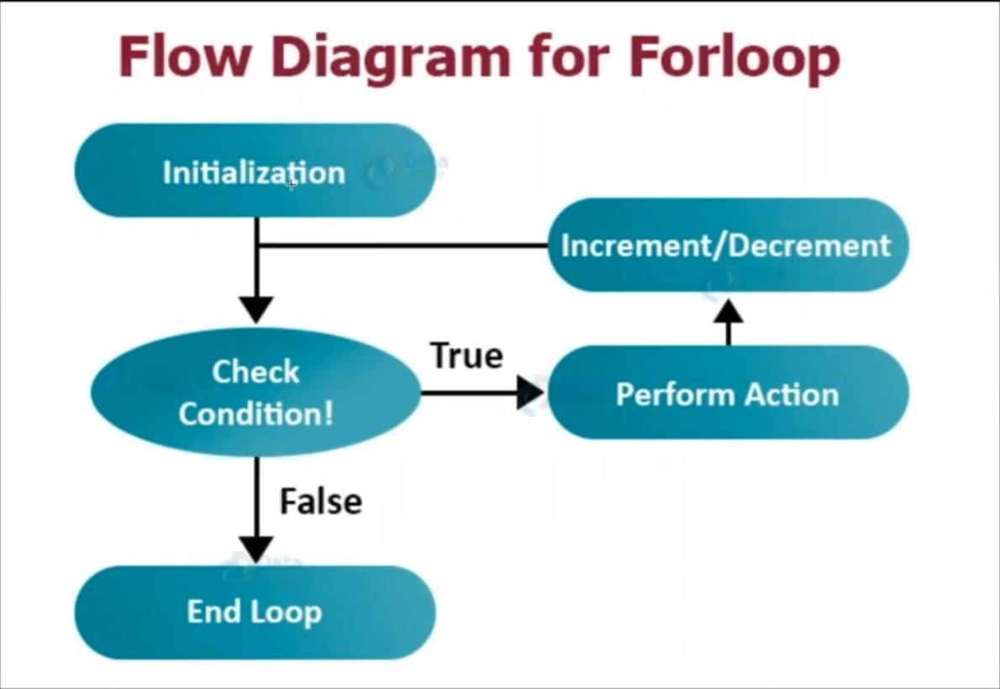
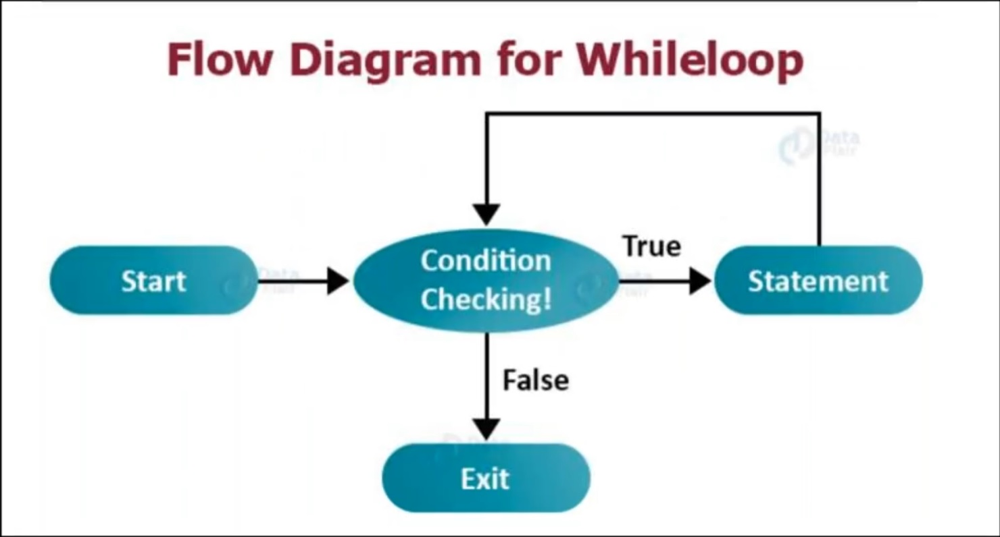
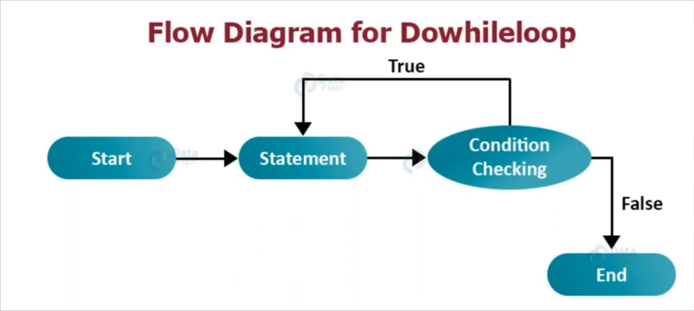

# Introduction to Core Java - NaveenAutomationLabs

## Basics

- January 2019 -> OpenJDK and Oracle JDK (Paid JDK)
- OpenJDK > Totally free, free to use for everyone 
- Oracle JDK > Made for building and use in enterprise level application, Extra services and support provided by Oracle (if you raise a bug or fail to do any configuration)
- JDK (Java Development Kit) -> Design + Compile + (JRE) Run Java code + Tools + Libraries + Jars + binaries (Required to development the application)
- JRE (Java Runtime Environment) -> JRE is subset of JDK, required to execute the code (Required on client side to run the application built by the developer) 

## Data types

- Data type: Type of data a variable is going to hold
- Primitive data types: They will directly associate with the memory allocation, no need to create object
- Non-primitive data types: String, ArrayList, HashMap -> without creating objects we can't use it.
- Integer family: byte, short, long int
- Floating family: double, float
- Character: char (char is treated as special unicode character, unicode character is special ASCII number represented by each and every character)
- char will use ASCII value when you are doing any arithmetic operation with them. Important ASCII value ranges are given below:
  - a to z: 97-122
  - A to Z: 65-90
  - 0 to 9: 48-57
- Boolean: boolean - true / false
- String (Non-primitive data type)


## Operators

- string (op) string = string
- string (op) int = string
- int (op) string = string
- int (op) int = int
- int (op) double = double
- double (op) int = double
- double (op) double = double
- char (op) char = int
- char (op) int = int
- int (op) char = int
- Arithmetic operators
  - +: Addition
  - -: Subtraction
  - *: Multiplication
  - /: Division
  - %: Modulus
- Increment and decrement (unary) operators
  - Post-increment (First assign/use and then increment)
  - Post-decrement
  - Pre-increment (First increment and then assign/use)
  - Pre-decrement
  - Increment and decrement operators can't be used on String and boolean data-types
- Relational operators
  - < : Less than operator
  - \> : Greater than operator
  - <= : Less than or equal
  - \>= : Greater than or equal 
  - == : Equality operator
  - != : In-equality operator
- Dead / unreachable code: A piece of code which never gets a chance to execute
- Logical Operators
  - && (Logical AND)
  - || (Logical OR)
  - ! (Logical NOT)

## Conditional Statements

- if statement
  - It is a bad practice to use multiple if blocks such as the following
  - Because if the first condition is satisfied then unnecessarily checking all the conditions below from top to bottom will impact the performance of the system
- if-elseif statement
  - Partially solves the problem of if statement
  - But this approach we got a down-side as well, if only the last if condition is satisfied for a value then we will be unnecessarily checking all the conditions above it which will again impact the performance of the system
- switch statement
  - Solves the problem of previous two approaches
  - Limitation of switch is it works only with: 'char, byte, short, int, Character, Byte, Short, Integer, String, or an enum'
  - It does not work with: long, float, double and boolean values
  - We can't pass any condition / expression to switch-case
  - `break` statement is only allowed inside switch statement or loops 

## Loops

- for-loop
  - Used when we want to iterate a fixed number of times
  - Specifying initialization and increment/decrement in the loop is optional
  - If we do not specify initialization, condition and increment/decrement then the for loop will act as an infinite loop
  - 
- while loop
  - Used when you are aware of the precondition, want to iterate based on a condition
  - 
- do-while loop
  - while loop will immediately check the condition before executing the body of the loop
  - Whereas, do-while will at least execute the body of the loop once and then the condition will be checked
  - 
- for-each loop
  - Useful for iterating arrays and collections
- forEach() method loop
  - Introduced in Java 8

## Static Arrays

- Arrays are used to store data of similar data-types in contiguous memory location
- Starting index of an array is 0
- Limitations:
  - Size is fixed - to overcome this problem we can use ArrayList (Collections)
  - Can store only similar data types - to overcome this we can use an array of Object class

## Dynamic Arrays

- Dynamic arrays are implemented by creating object the class ArrayList
- ArrayList is an index based linear collection
- Virtual/Initial capacity: How many elements can be stored inside the array
- Physical/Actual capacity: How many elements are actually stored inside the array, arr.size() method will return the physical capacity
- ArrayList internally will create a static array and will allocate memory to store 10 elements (default virtual capacity = 10)
- Upon adding the 11th element the virtual capacity of the array will increase by 5
- We can increase the Virtual capacity of the ArrayList by passing it as an argument to the ArrayList object
- ArrayList without generic or type are considered as raw type
- We can add generics/types for ArrayList
- Generic or type should be non-primitive
- Practical use of ArrayList / dynamic arrays to store links in amazon where the count change every week

## HashMap

- HashMap stores the values in the form of key-value pair 
- Default virtual capacity of HashMap is 16 
- Based on the key of the HashMap, Java will generate a hash code which in an integer number and based on that integer Java will calculate and place that object into a random index of the memory (0 - 15), this is the reason why in HashMap the elements will not maintain any order
- IMPORTANT: If a key results in the same hash code / evaluates same index which has been pre-occupied, the object then will be saved in the same segment/index in the form of LinkedList (2nd node of the LinkedList), this is called collision in HashMap 
- For larger applications through Hashing if we keep on getting same index for different keys it will create a long chain of nodes which in turn will decrease the performance of the system - O(n) complexity to search a node in the LinkedList of a segment/index 
- Hence, in Java 8: They set the threshold value of the LinkedList nodes to 8 and on adding 9th element the LinkedList will be converted into a balanced binary tree - O(log N) complexity to search a node in the balanced binary tree
- How it will calculate the HashCode? Java will call the hashCode() method that Object class has on the key and will generate the hash code. Then Java will perform modulo operator on the hash code with the default virtual capacity (i.e. 16) and will calculate the index

## Class and Object

- Class is an entity or a template to define the objects
- e.g. Employee, company, school, humans, cars all are different categories and categories will define the objects
- `Employee emp1 = new Employee()`: `new Employee()` creates the object 
- `emp1` is the object reference name that points to the object created
- Inside the object Java will create copy of all the class variables
- There is no limitation to create an object we can create any number of objects
- Java will create the object in the heap memory
- Object reference will be created in the stack memory
- Heap memory is also divided into multiple parts - permanent generation, small generation (search on the web)
- JVM runs the Garbage collector automatically, whenever JVM finds that heap memory getting occupied heavily
- Garbage collector will then remove those objects which are not having any references
- Garbage collector will destroy the objects having no name, or having the null reference name
- Garbage collector will not perform any clean up task in stack memory
- We should always point to an object with the help of a reference variable, or we might end up creating different objects to store different values (`new Employee().username = "Deepjyoti"`);

## Methods

- Method is a block or generic piece of code which is responsible for performing a certain task, 4 types
  - No input, no return value
  - No input, some return value
  - Some input, no return value
  - Some input, some return value
- Limitation: We cannot create a method inside another method
- main() method is the entry point of the program execution
- main() method is void in nature because it is focused towards executing the program and not returning any value to JVM
- JVM will never store any static method inside the object, only non-static methods will be stored
- Method overloading (OOP - Polymorphism - Compile time polymorphism):
  - with-in the same class when we have different methods with the same name and 
  - different parameters and 
  - sequence of the parameters are also different
- Poly = many, morphs = forms -> it can have two things method overloading and method overriding
- Without method overloading we may need to provide longer names to support using different methods

## Static and Non-static Context

- Local variables can't be static, it can only be used at the class level (properties and methods having global scope)
- Access static variables and methods
  - Within the same class you can access them directly, or via class name, or via creating the object of the class
  - Outside the class it can be accessed via the class name, or via creating the object of the class
- Accessing static variables and methods via the object reference is discouraged as they are not a part of the object
- e.g. No of wheels of a cars should be a common property, hence it should be a static variable
- main() method is static in nature so that JVM can call the main() method without creating the object of the class
- If main() method is overloaded, JVM will call the main() method having `public static void main(String[] args)` as signature
- Non-static properties and methods are stored inside the object and the object itself is stored inside the `Heap memory`
- Object references are stored inside the `Stack memory`
- Static properties and methods are stored inside the `Permanent Generation` / `Common Memory Allocation (CMA)` which is part of Heap memory
- All the objects created will be having access to the `Permanent Generation` / `CMA` area
- Before JDK 1.8 static members were stored the extended part of the stack memory called `Method Area` created by JVM after class compilation
- `Method Area` section was used to store static variables of the class, metadata of the class, etc
- If any static method is called recursively to an extent that it consumes all the `CMA` area then JVM will throw `java.lang.StackOverflowError`
- `Heap memory` is used for the dynamic memory allocation of Java objects and JRE classes at runtime
- `Heap memory` is divided into three parts: `New or young generation`, `Old or tenured generation`, `Permanent generation`
  - `Young Generation`
    - This is where all new objects are allocated and aged. A minor Garbage collection occurs when this fills up
    - Young generation has three more parts: `Eden`, `Survivor1` and `Survivor2`
      - `Eden`: All the newly created objects are allocated in `Eden` space 
      - `Survivor1` and `Survivor2` : When the `Eden` is full, a minor garbage collection happens, and the live objects are moved to `Survivor1` and then to `Survivor2`
    - Objects that survive `Eden`, `Survivor1` and `Survivor2` are moved to `Old generation`. In `Old generation` the garbage is collected less frequently, so `Survivor1` and `Survivor2` spaces are used to make sure that only long survived objects are moved to `Old generation`
  - `Old Generation`: This is where long surviving objects are stored. When objects are stored in the `Young Generation`, a threshold for the object's age is set, and when that threshold is reached, the object is moved to the `Old generation`. A major garbage collection runs on the old generation to collect dead objects
  - `Permanent Generation`: `Permanent generation` is used by JVM to store metadata about the classes and methods. JVM also stores Java standard libraries in permanent generation. This space is cleaned as a part of full garbage collection
- Inside the same class
  - static to static call: directly / via class-name
  - static to non-static call: via creating object
  - non-static to static call: directly / via class-name
  - non-static to non-static call: directly 
- References: [static-variable-in-java](https:-www.scaler.com/topics/java/static-variable-in-java/)
- References: [heap-memory-and-stack-memory-in-java](https:-www.scaler.com/topics/java/heap-memory-and-stack-memory-in-java/)

## Constructor

- Constructor is used to initialize the instance variables of an object
- Name of the constructor will remain same as the class name
- Constructor will be called at the time of object creation
- Constructor looks like a function, but it is not a function
- Constructor will never return a value: no return or no void keywords in constructor, but a function may or may not return a value

## this keyword

- The `this` keyword is used to represent the current instance of a class
  - It is used to access the instance variables and assign values to them
  - Invoke current class methods and constructors, constructor chaining
  - The `this` keyword can be passed/returned as an argument to a method call representing the current class instance, method chaining
- If we don't want to use `this` keyword then we should name the local variable differently from the class variable

## Encapsulation and Data Hiding

- Encapsulation: Data Encapsulation can be defined as wrapping the code or methods (properties) and the related fields or variables together as a single unit
- In object-oriented programming, we call this single unit - a class, interface, etc
- Data encapsulation helps organize thousands of lines of code for better readability and management. At the same time, it protects the sensitive data as well by restricting access to internal implementation details
- Data Hiding: Wrapping the (private, default, protected) properties and methods in a unit and restrict direct access to them, then create a public layer (method) so that anyone from outside (the class) can have access of them
- The basic difference between encapsulation and data hiding is that Encapsulation is a way of bundling data whereas Data Hiding prevents external unauthorized access to the sensitive data

| Access Modifier | Within Class | Within Package | Same Package by Subclasses | Outside Package by Subclasses | Global |
|-----------------|--------------|----------------|----------------------------|-------------------------------|--------|
| Public          | Yes          | Yes            | Yes                        | Yes                           | Yes    |
| Protected       | Yes          | Yes            | Yes                        | Yes                           | No     |
| Default         | Yes          | Yes            | Yes                        | No                            | No     |
| Private         | Yes          | No             | No                         | No                            | No     |

## Inheritance, Method Overriding and use of `final` keyword

- Inheritance: Inheritance is an object-oriented programming concept in which one class acquires the properties and behavior of another class
- It represents a parent-child relationship between two classes. This parent-child relationship is also known as an IS-A relationship
- Inheritance provides code re-usability
- A superclass, also known as parent class or base class
- A subclass, also known as child class or derived class
- Multiple inheritance is not allowed in Java, because it creates the famous Diamond problem
- Diamond Problem:
  - If same method is there in both the parent classes then child class is not sure which one to inherit
  - When we are creating an object of the child class, child class is not sure which parent class's constructor to be called
- Diamond is solved with the help of interfaces
- Method overriding: When we have a parent class having the same method with same name and same number of parameters in child class. For method overriding 
  - The method name should be same
  - The no of parameters of the methods in child and parent classes should be same
  - The order of parameter of the methods in child and parent classes should be same
  - The return type of the methods in both the classes should be same
  - Access specified in child class should be equal or greater than that of the parent class (e.g. if parent method is protected, child can have method as protected or public but not default or private)
- static methods can't be overridden in Java, because static methods are not a part of the object, but method overloading is allowed
- Up casting / Top casting: Child class object can be referred by parent class reference variable
- Method overriding -> Dynamic or run time polymorphism, as start() method is present in both parent and child class so compiler does the reference type check and takes the decision at runtime to execute the respective method based on the object passed
- Reference type check does not allow a parent class reference variable to call a method which is present only in child class
- Down casting: Parent class object is referred by child class reference variable
- Down casting is allowed during compile time
- Down casting at runtime will give you `java.lang.ClassCastException`
- If a method is declared as `final` then the method can't be overridden
- If a class is declared as `final` then the class can't be extended / inherited
- If a variable is declared as `final` then the value of variable can't be changed

## Interface, Multiple Inheritance

- Interfaces in Java are a set of abstract and public methods we want our classes to implement
- It is the blueprint of a class and contains static constants and abstract methods
- Interface cannot have any method body, it can only have method prototype / method declaration
- Interface is only for building the prototype, achieve abstraction and implement multiple inheritance
- We cannot create the object of an interface
- All the variables in interface are public, static and final in nature by default
- All the methods in interface are public and abstract in nature by default
- Class to class inheritance -> extends
- Interface to interface inheritance -> extends
- Interface to class inheritance -> implements
- An Interface cannot extend a class
- After JDK 1.8:
  - We can have static methods in Interface with method body
    - It is allowed because static methods can't be overridden in Java
  - We can also have default methods
    - The default methods can be overridden
    - If a class / interface is inheriting same default methods from multiple interfaces then it will again fall into the Diamond problem, so in such case compile time error will be shown
    - If a class is inheriting the default method of an interface and also inheriting the same public method (public method with same method signature as the default method) from another class then the public method of the class will override default method of the interface in the implementing class
    - i.e. in this case public method of the class will be inherited to the child class, and not the default method of the interface
- Advantages:
  - Interfaces can be used to enforce a contract - that is, provide a specification that classes must implement certain methods if they want to use that interface - Any Car class must implement certain methods like start, stop, etc. This can be enforced by using an interface such that every class implementing the Car interface must implement all the enclosing methods.
  - Interfaces are used to achieve multiple inheritance - Our Honda Civic class can extend the DieselCar class and implement the Sedan interface, effectively achieving multiple inheritance from both the classes.
  - Interfaces can be used to achieve loose coupling - With interfaces, we can ensure that changes in one class do not affect other classes.
- Disadvantages:
  - Interfaces expose their member variables since they must be public. This could lead to some issues with respect to predicting the behavior of your code and testing(and the same reasons why one should avoid making class member variables public).
  - Since an interface can be thought of as a contract implemented by multiple classes, in certain cases, modifying the interface could lead to unpredictable behavior for the classes implementing them. For example, if a new method is added that is not default, all the old classes will throw compilation errors if those classes do not implement that method. To prevent this, as far as possible, interfaces must be immutable(this could be a disadvantage in certain situations, too).
  - If interfaces are not designed carefully, one interface could contain many methods that might not all be needed for a class. Hence, these methods may end up having an empty implementation, which may make your code verbose. To overcome this, interfaces must be designed carefully, keeping the Interface Segregation Principle in mind.
- Changes in recent Java versions:
  - From Java 8, interfaces can now implement a method and don’t need to be abstract. This is to support backward compatibility, i.e., in older versions of java, if you add a new method to your interface and you already have classes implementing your interface, you would have to make changes to all of them to implement the new method. Enter default methods in an interface. Since the new method has a default implementation, older classes will not need to implement it. However, newer classes can still override the default method with their own implementations.
  - Static methods can also be added to an interface, which can be called directly from outside the interface.
  - From Java 9, private / private static methods can also be created within an interface. The only purpose of these methods is to serve as helper methods for other methods since no objects of an interface can be created.

## Abstraction

- Abstraction is the process of hiding the internal details of an application and displaying only essential information from the outer world.
- Two types:
  - Data Abstraction: When the object data is not visible to the outer world, it creates data abstraction. If needed, access to the Objects’ data is provided through some methods.
  - Process Abstraction: We don’t need to provide details about all the functions of an object. When we hide the internal implementation of the different functions involved in a user operation, it creates process abstraction.
- It can be achieved via:
  - Abstract classes
  - Interfaces Let’s model the characters and objects from the very famous Angry Birds game to understand these concepts in detail.
- An important point to note here is that getting the right level of abstraction i.e. exposing just the right interface with the right amount of detail is the key to making software that is easily testable, extensible and maintainable. Too much abstraction can make the software hard to understand or inflexible and too little can make it complex to write and maintain.
- Abstract class in Java is a collection of abstract and non-abstract methods.
- Abstract methods do not have a body or implementation. The implementation for the abstract methods is provided by the child classes which extend the abstract class.
- Basically, an Abstract Class is nothing but a blueprint for the child class. Abstract classes justify the layout of your idea and does not really implement them.
- Important point about abstract methods and classes:
  - An abstract class has to be extended else it has no meaning similarly an abstract method has to be overridden
  - An abstract method has no-body
  - If a class has an abstract method the class has to be marked abstract. In other words concrete classes cannot have abstract methods. (because what if we allowed that and someone called them 🙂
  - You can have both abstract and non-abstract methods in abstract classes Let’s extend our model further to understand some more concepts related to abstraction in Java
- Reasons to use abstract class:
  - Template: Abstract classes provide a blueprint to be followed by the classes that extend the Abstract class.
  - Loose coupling: A method or class is almost independent in loose coupling, and they are less dependence on each other. In other words, the more one class or method knows about another class or method, the more tightly coupled the structure becomes. Loose coupling provides:
    - Easy maintenance of the code. Changes can be made on one class without affecting other classes.
    - Testing of loosely coupled structures is easier, as we can divide the project into small modules and perform unit testing.
  - Code re-usability: Using an abstract class in an application saves time. We can declare an abstract method in the abstract class and call it from anywhere required
  - Abstraction: Data abstraction in Java helps the developers hide the actual method implementation from the end-user and display only the method names (APIs)
  - Dynamic resolution: The Abstract Classes enable us with dynamic method resolution or the dynamic method dispatch process. The dynamic Method Resolution is a procedure where, at runtime, calling of an overridden method is resolved. This is how RunTime polymorphism is implemented.
- Rules for using abstract class:
  - You have to use the keyword abstract.
  - You cannot instantiate an abstract class.
  - An abstract class can contain both abstract and non-abstract methods.
  - You can include non-abstract final methods (a method which cannot be overriden) as well in your abstract class.
  - Final methods in abstract classes can not be abstract. They must be implemented in the abstract class itself.
  - You can also include constructors and non-abstract static methods in your abstract class.
- Rules of abstract method:
- A method declared with the abstract keyword is called an Abstract method.
  - Abstract method can only be declared inside an abstract class or an interface.
  - Abstract methods must not contain any definition or body in abstract class.
  - You must end the declaration of the abstract method using ';'(semicolon).
  - In order to write the implementation code of these abstract method, you must inherit the abstract class. Then the child class can write the definition for the abstract methods.
  - If you don't define the abstract method inside the child class, then you must declare the child class as abstract otherwise compiler will throw error.
- When to use abstract class:
  - When trying to use the inheritance concept in code (share code among many related classes), by providing common base class methods that the subclasses override
  - If we have specified requirements and only partial implementation details
  - While classes that extend abstract classes have several common fields or methods (that require non-public modifiers)
  - If one wants to have non-final or non-static methods to modify the states of an object
- When to use an interface:
  - If the problem needs to be solved using multiple inheritances and is composed of different class hierarchies
  - When unrelated classes implement our interface. For example, Comparable provides the compareTo() method that can be overridden to compare two objects
  - When application functionalities have to be defined as a contract, but not concerned about who implements the behavior. i.e., third-party vendors need to implement it fully
- Abstract Class vs Interface

| Abstract Class                                                                          | Interface                                                     |
|-----------------------------------------------------------------------------------------|---------------------------------------------------------------|
| An abstract class can contain both abstract and non-abstract methods.                   | Interface contains only abstract methods.                     | 
| An abstract class can have all four; static, non-static and final, non-final variables. | Only final and static variables are used.                     |
| To declare abstract class abstract keywords are used.                                   | The interface can be declared with the interface keyword.     | 
| It supports multiple inheritance.                                                       | It does not support multiple inheritance.                     | 
| The keyword ‘extend’ is used to extend an abstract class.                               | The keyword implement is used to implement the interface.     |
| It has class members like private and protected, etc.                                   | It has class members public by default.                       |
| An abstract class can declare constructors and destructors.                             | An interface cannot declare constructors or destructors.      |
| Abstract class can provide the implementation of interface.                             | Interface can't provide the implementation of abstract class. |
| An abstract class has protected and public abstract methods.                            | Interface can't provide the implementation of abstract class. |

## Builder Pattern

- Builder Pattern says that every method can return the same class object
- Helps in method chaining and make the code more readable
- We can apply the technique of method chaining only to those methods which are not returning anything
- Disadvantage with this approach is that it violates the POM
- As here we won't be able to write the assertion, we have to write the assertion/validation within the Page class

## Exception Handling

- Exception Handling: Whenever any kind of exception or error is coming in our program, we have to bypass / ignore / handle that particular exceptions.
- Exception is handled in Java with the help of `try-catch` block. `try` block can't be alone it must follow with a `catch` or `finally` block
- Every exception like `ArithmeticException`, `IndexOutOfBoundsException` etc. is a child of `Exception` class
- `Throwable` is the super-class of `Exception` class which has two child classes: `Exception` and `Error`
- Exception comes because of improper handling in your code
- Error usually comes because of environment, configuration, system or compiler - rules are not defined accordingly
- When we want to handle `Exception` and `Error` together we should use `Throwable` class
- `Exception` is more common than `Error`
- `finally` block will always be executed irrespective of the fact whether the exception has occurred or not
- We can have a `finally` block without any catch block, but not without `try` block
- `finally` block is used for closing db-connection objects, file-reader objects, scanner-objects etc. If not closed properly we might overload the server with db-connection requests and server might go down
- `throws` keyword is used to pass the exception object from the current method to caller method
- `throws` keyword is not used to handle the exception
- We can propagate multiple exception at time with the help of `throws` keyword separating them by commas.
- We can generate our own exception with the help of `throw` keyword
- We should never use `throws` keyword for the utility methods in our framework because that has to be then handled by the @Test methods

## Final, Finally and Finalize

- `final` keyword can be used on classes to prevent inheritance
- `final` keyword can be used on methods to prevent method-overriding
- `final` keyword can be used on variables to turn them into a constant
- If `final` variable are not initialized at the time of declaring them as final, then we can assign value to them only once
- `finally` block will always be executed irrespective of the fact whether the exception has occurred or not
- We can have a `finally` block without any catch block, but not without `try` block
- `finally` block is used for closing db-connection objects, file-reader objects, scanner-objects etc. If not closed properly we might overload the server with db-connection requests and server might go down
- `finalize()` method is associated with Garbage collector
- Whenever Garbage Collector need to destroy the object before that if you have a `finalize()` method in our class, that method will be called first and then immediately Garbage Collector will destroy the object
- `finalize()` method is present in the `Object` class
- Before destroying excel-connection, db-connection, file-reader objects if we want to close the connection we can do it inside the `finalize()` method
- When destroying one class object from another class, `finalize()` method will not be called if we won't have any finalize() method associated with the class object we are trying to delete.

## String

```java
package com.academy.naveenautomationlabs;

import org.testng.annotations.Test;

public class Java19_StringConcepts {

  public static String reverseString(String value) {
    if (value == null)
      return null;

    int len = value.length();

    if (len == 1)
      return value;

    String rev = "";
    for (int i = len - 1; i >= 0; i--) {
      rev = rev + value.charAt(i);
    }

    return rev;
  }

  @Test
  public void demo() {
    String s1 = "naveen";                           // Object created in String Constant Pool (SCP) area inside the heap
    String s2 = "selenium";
    String s3 = "naveen";                           // Object not created, s3 is pointing to the same string s1 in pointing to in SCP area - advantage of this is memory utilization

    s2.concat(s1);
    System.out.println(s2);                         // selenium, because in Java strings are immutable in nature
    s2 = s1.concat(s2);
    System.out.println(s2);                         // seleniumnaveen, because now the reference variable s2 is pointing to the new object created

    System.out.println(s1 == s3);                   // true
    System.out.println(s1.equals(s3));              // true


    String s4 = new String("naveen");               // New object created directly inside the heap area
    String s5 = new String("naveen");               // New object created directly inside the heap area

    System.out.println(s4 == s5);                   // false
    System.out.println(s4.equals(s5));              // true

    // String reversal programmatically
    System.out.println(reverseString("Deepjyoti"));

    // StringBuffer is mutable class
    // String reversal using StringBuffer class
    StringBuffer sb = new StringBuffer("Selenium");
    sb.reverse();
    System.out.println(sb);
  }
}
```

## `super` and `this` keyword

- `super` keyword is used to access the properties and methods of super class
- Especially used when certain properties and methods are overridden in child class
- Syntax: `super.<parent-property-name>` or `super.<parent-method-name>`
- `super()` call can be used to call the constructor of the parent class
- At the time of object creation of the child class internally child class will call the default constructor of the parent class
- `super()` call should be the first statement of the constructor inside the child class
- We can't have two `super()` calls inside the child class constructor
- `this` keyword has three uses:
  - `this` is used to point to the current / active object reference of the class
  - `this` in Builder pattern is used for method chaining
  - `this()` call is used for constructor chaining, to call the one constructor from another inside the same class
    - Like `super()` - `this()` call should also be the first statement of the constructor inside the same class